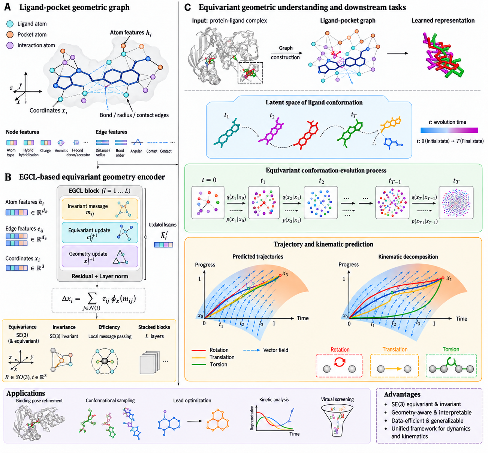

# ReDiFlow:Redistribution-Decoupled Riemannian Flow Matching for Molecular Docking


## Overview

ReDiFlow is an inference-time framework for Riemannian flow-based molecular docking. It combines non-uniform temporal redistribution with separate effective clocks for ligand translation, global rotation, and internal torsion.

At each sampling step, the three components are evaluated at their respective effective times using the same current molecular state, and their updates are applied jointly. This allows different temporal progressions while preserving geometric coupling between the components.

ReDiFlow operates on a pretrained docking backbone without changing its parameters or training objective.
<p align="center">

</p>

## Method overview

Standard generative docking evolves translation, rotation, and torsion using one shared scalar time. ReDiFlow relaxes this constraint in two stages:

1. **Global temporal redistribution** replaces uniform progression with a non-uniform shared schedule.
2. **DOF-wise temporal decoupling** assigns independent effective times to translation, rotation, and torsion.

At every sampling step, the pre-trained backbone is queried using the same current protein-ligand state. Each degree of freedom uses its own effective time, and the component-wise updates are then applied jointly. The dynamics are therefore temporally decoupled but state-coupled.

## Content
- [Installation](#installation)
- [Data preparation](#data-preparation)
  - [Existing datasets](#existing-datasets)
  - [Expected input structure](#expected-input-structure)
  - [Extract protein sequences](#extract-protein-sequences)
  - [Generate ESM-2 embeddings](#generate-ESM-2-embeddings)
  - [Merge protein embeddings](#merge-protein-embeddings)
  - [Build processed molecular data](#build-processed-molecular-data)
- [Inference](#inference)
  - [Default ReDiFlow schedules](#default-ReDiFlow-schedules)
- [License](#license)
- [Citation](#citation)

## Installation

The code was tested with:

- Python 3.10.15
- PyTorch 2.5.1+cu124
- PyTorch Geometric 2.6.1
- CUDA 12.4
- RDKit 2026.03.1

Create and activate a Python environment:

```bash
conda create -n rediflow python=3.10.15 -y
conda activate rediflow
```

From the repository root, install the dependencies:

```bash
pip install -r requirements.txt
```

<!-- TODO(release): replace the placeholders with the real filenames and environment name. -->

## Data preparation

The experiments use the following datasets:

- **PoseBusters V1** for backbone training and in-domain evaluation.
- **ASTEX Diverse** for external evaluation.
- **DockGen** for evaluation on unseen binding sites.
- **PDBBind time-split** for evaluation under temporal distribution shift.

There are 426 usable PoseBusters protein-ligand complexes after preprocessing, with 383 used for backbone training and 43 held out for in-domain testing.
### Existing datasets 

Astex and PoseBusters datasets can be downloaded [here](https://zenodo.org/records/8278563). PDBBind_processed can be found [here](https://zenodo.org/records/6408497). DockGen can be downloaded from [here](https://zenodo.org/records/10656052).

### Expected input structure

Each protein-ligand complex should contain a receptor structure and a ligand structure. The examples below assume the following layout:

```text
data/PDBBind/
├── <COMPLEX_ID_1>/
│   ├── protein.pdb
│   └── ligand.sdf
├── <COMPLEX_ID_2>/
│   ├── protein.pdb
│   └── ligand.sdf
└── ...
```

The same workflow can be applied to PoseBusters, ASTEX Diverse, DockGen, or another dataset by changing the input and output paths. If a dataset provides ligands in `.mol`, `.mol2`, or another format, convert them to SDF or update the molecular loader accordingly.

### Extract protein sequences

Extract the receptor sequences from the raw protein structures and write them to one FASTA file:

```bash
python extract_fasta.py \
  --data_dir "data/PDBBind" \
  --out_file "data/PDBBind_sequences.fasta"
```

Output:

```text
data/PDBBind_sequences.fasta
```

### Generate ESM-2 embeddings

Use the ESM-2 `esm2_t33_650M_UR50D` model and extract representations from layer 33:

```bash
python esm/scripts/extract.py \
  esm2_t33_650M_UR50D \
  "data/PDBBind_sequences.fasta" \
  "data/PDBBind_esm2_embeddings_raw" \
  --repr_layers 33 \
  --include mean per_tok
```

This creates one raw embedding file for each protein sequence under:

```text
data/PDBBind_esm2_embeddings_raw/
```

### Merge protein embeddings

Merge the individual ESM-2 outputs into a single PyTorch file:

```bash
python merge_embedding.py \
  --esm_embeddings_path "data/PDBBind_esm2_embeddings_raw" \
  --output_path "data/PDBBind_esm2_embeddings.pt"
```

Output:

```text
data/PDBBind_esm2_embeddings.pt
```

### Build processed molecular data

Combine the raw structures and merged protein embeddings into the processed dataset used by the model:

```bash
python process_mols.py \
  --origin_path "data/PDBBind" \
  --pt_path "data/PDBBind_esm2_embeddings.pt" \
  --out_file "data/PDBBind_processed"
```

The resulting processed data are written to:

```text
data/PDBBind_processed/
```

During molecular graph construction, the current implementation removes hydrogen atoms, uses atomic number and chirality as node features, and constructs distance-based ligand and ligand-receptor edges. The reference setup uses a 5.0 A atom-level interaction cutoff, at most 8 nearest neighbors per atom, a 15.0 A receptor-pocket radius, and up to 24 nearest receptor C-alpha neighbors.

## Inference

Initial ligand poses are generated through random rigid-body and torsional perturbations without native pocket information. The reference protocol generates 40 candidates per complex, applies 10 outer sampling steps, and ranks the resulting poses using a confidence model.

Run inference on the processed dataset with a trained checkpoint:

```bash
python inference_base.py \
  --ckpt_path "runs/<RUN_ID>/checkpoints/<CHECKPOINT>.ckpt" \
  --data_dir "data/PDBBind_processed" \
  --origin_data_dir "data/PDBBind"
```

Replace `<RUN_ID>` and `<CHECKPOINT>` with the actual training run and checkpoint filename. The manuscript configuration uses 10 sampling steps, 40 candidates per complex, and random seed 42; confirm that the corresponding values are set in the inference configuration before reproducing the reported results.
The inference script automatically outputs the results after completion.

### Default ReDiFlow schedules

Each per-DOF schedule is independently normalized to sum to 1.

| Step $t$ | 0 | 1 | 2 | 3 | 4 | 5 | 6 | 7 | 8 | 9 |
| --- | ---: | ---: | ---: | ---: | ---: | ---: | ---: | ---: | ---: | ---: |
| $\Delta t_{\mathrm{tr}}$ | 0.1400 | 0.1300 | 0.1200 | 0.1100 | 0.1000 | 0.1000 | 0.0900 | 0.0800 | 0.0700 | 0.0600 |
| $\Delta t_{\mathrm{rot}}$ | 0.1300 | 0.1300 | 0.1200 | 0.1200 | 0.1100 | 0.1000 | 0.0900 | 0.0800 | 0.0700 | 0.0500 |
| $\Delta t_{\mathrm{tor}}$ | 0.0539 | 0.0630 | 0.0878 | 0.1295 | 0.1657 | 0.1657 | 0.1295 | 0.0878 | 0.0630 | 0.0539 |

Translation and rotation receive larger steps early in sampling for global placement, whereas torsion receives larger steps in the middle of the trajectory for conformational refinement.

## License

License will be added in a subsequent release.

## Citation

Citation information will be added when the manuscript is publicly available.

```bibtex
@article{rediflow,
  title   = {ReDiFlow: Redistribution-Decoupled Riemannian Flow Matching for Molecular Docking},
  author  = {<AUTHOR LIST>},
  journal = {<VENUE OR PREPRINT>},
  year    = {<YEAR>}
}
```


